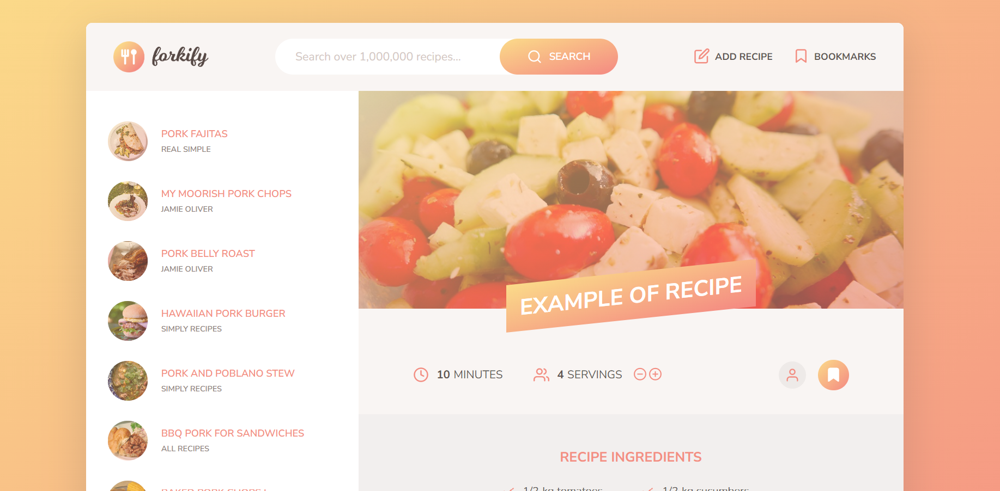
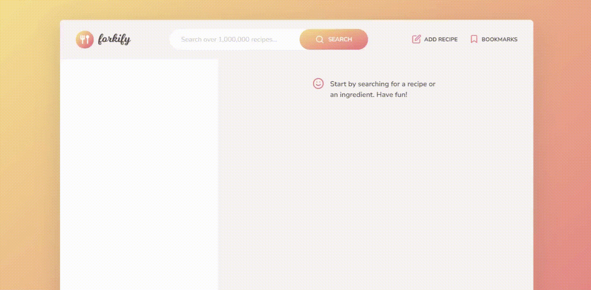
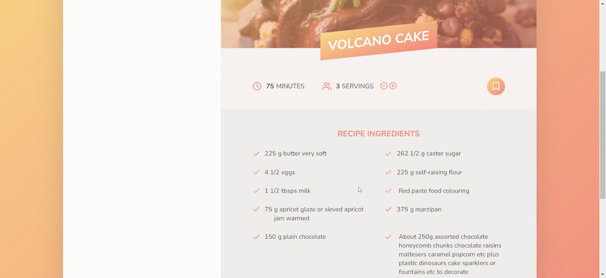

# Forkify

> Forkify is a project for someone, who likes delicious food, cooking and structured ES6+😋

  
Live site: <https://forkify-webapplication.netlify.app/>

### Used technologies

- Parcel
- Javascript
- MVC architecture  
- Forkify API
- Fractional library
- SASS
- Dotenv

## Table of Contents

- [Introduction](#forkify)
  - [Live site](#forkify)
  - [Used technologies](#used-technologies)
- [Overview](#overview)
  - [More about technologies](#more-about-technologies)
  - [Realized Features](#realized-features)
- [Setup](#quick-setup)
- [Contacts](#contacts)
 
  
## Overview

### More about technologies

1. Work with Forkify API (POST and GET requests) 
 

2. Use Parcel

- transpiling JS and bundling modules
- compiling SASS
 

3. Use MVC architecture

 

4. Use different Javascript features

>Classes, LocalStorage, window hash, rest and spread operators, shortcircuiting, optional chaining and etc.
 

5. Use Fractional librery for working with fracttions
 

6. Write JSDoc comment

        /**
          * Render the received object to the DOM
          * @param {Object | Object[]} data The data to be rendered (e.g. recipe)
          * @param {boolean} [render=true] If false, create markup string instead of rendering to the DOM
          * @returns {undefined | string} A markup string is returned if render=false
          * @this {Object} View instance
          * @author Dmitry Zaitsev
          * @todo Finish implementation
          */
          render(data, render = true) {
            if (!data || (Array.isArray(data) && data.length === 0))
              return this.renderError();

            this._data = data;
            const markup = this._generateMarkup();

            if (!render) return markup;

            this._clear();
            this._parentElement.insertAdjacentHTML('afterbegin', markup);
          }

 

7. Create and use SVG-sprite

        <svg class="nav__icon">
            <use href="src/img/icons.svg#icon-bookmark"></use>
        </svg>

 

8. Use SASS

> mixins, variables, nesting, extends(placeholders)
 
      %btn {
      background-image: $gradient;
      border-radius: 10rem;
      border: none;
      text-transform: uppercase;
      color: #fff;
      cursor: pointer;
      @include flexCenterItems;
      transition: all 0.2s;

      &:hover {
        transform: scale(1.05);
      }

      &:focus {
        outline: none;
      }

      & > *:first-child {
        margin-right: 1rem;
      }
    }

    .btn {
      @extend %btn;
    ...
    }
 

9. Use different CSS selectors 

        & > *:first-child {
          margin-right: 1rem;
        }

        &[name^="ingredient-"] {
          white-space: nowrap;
          overflow: hidden;
          text-overflow: ellipsis;
          width: 30%;
          margin-right: 0.5rem;
        }
 

10. Use Grid Layout

        display: grid;
          grid-template-rows: 10rem minmax(100rem, auto);
          grid-template-columns: 1fr 2fr;
          grid-template-areas:
            'head head'
            'list recipe';

        & button {
              grid-column: 1 / span 2;
              justify-self: center;
              margin-top: 1rem;
            }
 

### Realized features

1. Get data from API and show pagination 

>Pagination works so: 
> - 1-6 pages - show this number of pages
> - more 6 pages - always show 1 and last page 
> - if current page  is 1 - show next page and "..." 
> - if current page is last - show "...", then previous page
> - if current page is middle - show "...", then previous page, next page and "..."

 

2. Delete bookmarks(all and one), add recipe(auto addition to bookmarks), validation form, confirmation, renderring success and Error messages

 
   
3. Change servings

>also i didn't add code from controller.js and rest html code of recipe in this example

      

        <button class="btn--tiny btn--update-servings" data-update-to="${this._data.servings - 1}">
            <svg>
              <use href="${icons}#icon-minus-circle"></use>
            </svg>
        </button>
        <button class="btn--tiny btn--update-servings" data-update-to="${this._data.servings + 1}">
            <svg>
              <use href="${icons}#icon-plus-circle"></use>
            </svg>
        </button>
      

      addHandlerUpdateServings(handler) {
          this._parentElement.addEventListener('click', function (e) {
            const btn = e.target.closest('.btn--update-servings');
            if (!btn) return;
            const { updateTo } = btn.dataset;
            if (+updateTo > 0) handler(+updateTo);
        });
      }

      export const updateServings = function (newServings) {
        state.recipe.ingredients.forEach(ing => {
          ing.quantity = (ing.quantity * newServings) / state.recipe.servings;
          // newQt = (oldQt * newServings) / oldServings // 2 * 8 / 4 = 4
        });
        state.recipe.servings = newServings;
      };

## 🚀Quick Setup

1.  Clone this repository:

        git clone https://github.com/DmitriZaytsev/Forkify.git

2.  Install npm packages:

        npm i

3.  Open site in browser:

        npm run start

You can replace "npm" with the word "yarn", if you use it.

---

### 💌Contacts

Telegram: [@dmitr1_zaytsev](https://t.me/dmitr1_zaytsev)

Mail: <dmitri_zaytsev@bk.ru>

